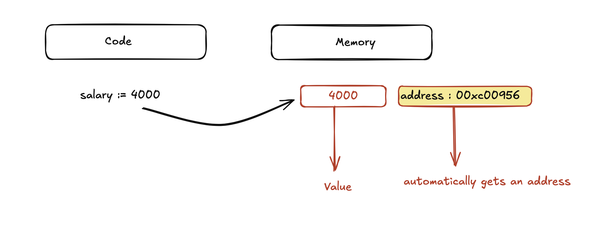
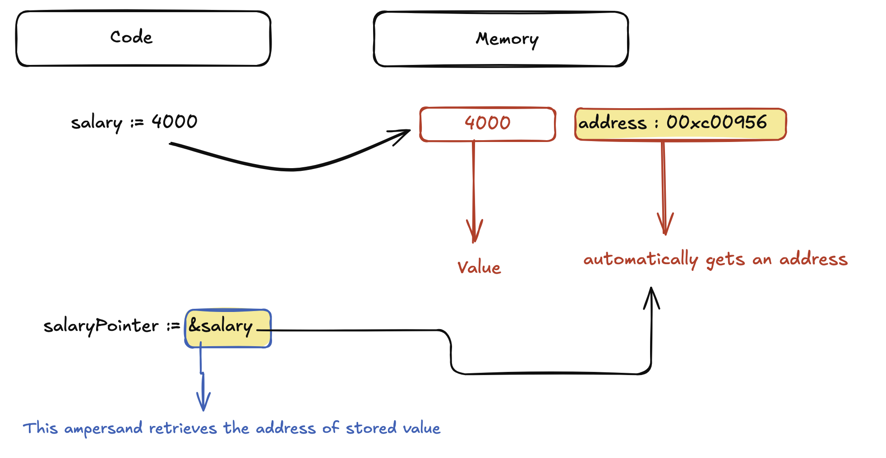
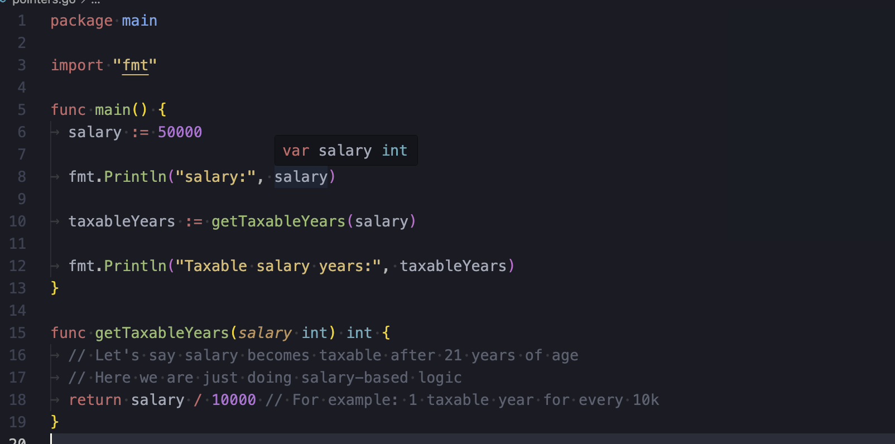

### We will cover these things

- What are pointers
- What are the advantages of pointers
- How can we actually use them
- And when not to use them

## What are pointers

Pointers are variables that hold the address of a value in your code. This address is somewhere in your computer's memory.

Now if you have a vague understanding of code, memory , addresses etc, then lets get a recap of things that i am talking about here.



When we create any data in our program, let's say I created a variable
salary := 4000, this value is stored in computer's memory and automaticaly gets an address.

and now this address is needed by the computer to be able to retrieve the actual value and use it wherever needed.

Lte's see how an actual pointer code looks like
salaryPointer := &salary

here is a visual represenatation



## Why do we need pointers if can can directly work with values instead

By default, in Go programs when we create a variable lets say salary := 3000, GO, will create a copy of that value of that variable salary that we might pass to a function that needs it

so until the function execution gets completed, we will have the same value twice in the memory that would end up taking twice the size.

so when we pass a pointer as an argumnet to a function, no copy gets created, rather the func receives the address

## Code without pointers



## Same code with pointers

```go
package main

import "fmt"

func main() {
	salary := 50000

	// Get a pointer to salary
	var salaryPointer *int = &salary

	fmt.Println("salary:", *salaryPointer)

	// Pass pointer to function
	taxableYears := getTaxableYears(salaryPointer)

	fmt.Println("Taxable salary years:", taxableYears)
}

// Accepts a pointer to int
func getTaxableYears(salary *int) int {
	return *salary / 10000
}
```
